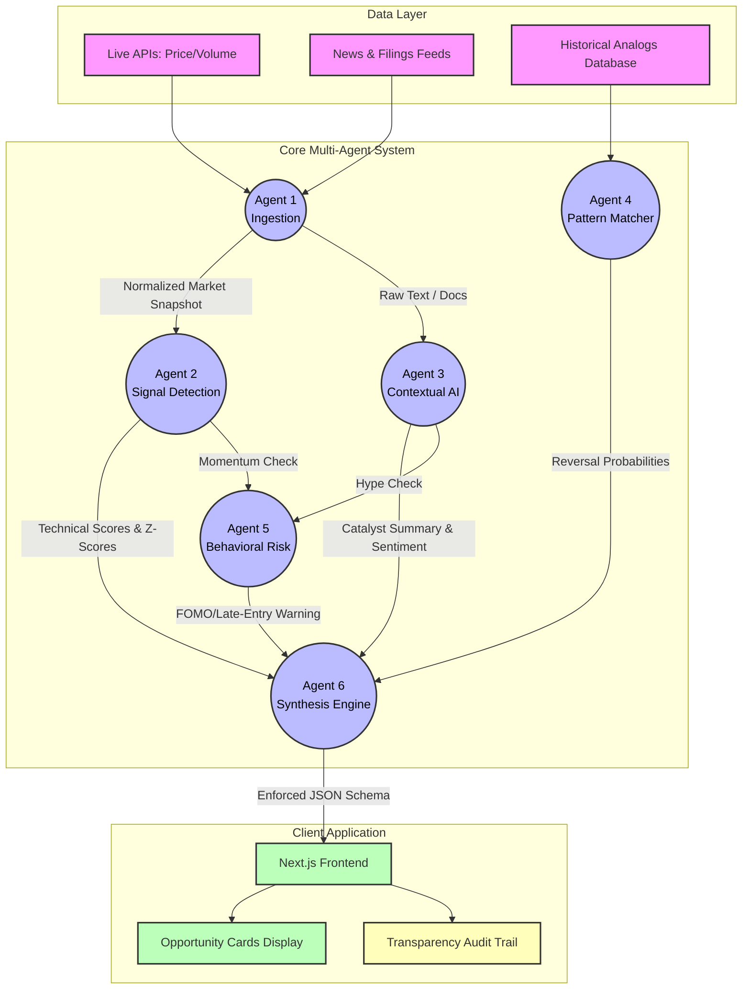

# SignalStack: Data Flow Architecture

This Mermaid diagram illustrates the flow of data through the 6-agent system, satisfying the ET Gen AI Hackathon Architecture Diagram requirement.

```mermaid
graph TD
    %% Define Styles
    classDef dataFill fill:#f9f,stroke:#333,stroke-width:2px;
    classDef agentFill fill:#bbf,stroke:#333,stroke-width:2px,color:#000;
    classDef outputFill fill:#bfb,stroke:#333,stroke-width:2px;
    classDef riskFill fill:#ffb,stroke:#333,stroke-width:2px;

    %% Data Sources
    subgraph Data Layer
        A1[Live APIs: Price/Volume]
        A2[News & Filings Feeds]
        A3[Historical Analogs Database]
    end

    %% Agents
    subgraph Core Multi-Agent System
        B1((Agent 1<br/>Ingestion)):::agentFill
        B2((Agent 2<br/>Signal Detection)):::agentFill
        B3((Agent 3<br/>Contextual AI)):::agentFill
        B4((Agent 4<br/>Pattern Matcher)):::agentFill
        B5((Agent 5<br/>Behavioral Risk)):::agentFill
        B6((Agent 6<br/>Synthesis Engine)):::agentFill
    end

    %% Execution Flow
    A1 --> B1
    A2 --> B1
    A3 --> B4

    B1 -->|Normalized Market Snapshot| B2
    B1 -->|Raw Text / Docs| B3
    
    B2 -->|Technical Scores & Z-Scores| B6
    B3 -->|Catalyst Summary & Sentiment| B6
    B4 -->|Reversal Probabilities| B6

    B2 -->|Momentum Check| B5
    B3 -->|Hype Check| B5
    B5 -->|FOMO/Late-Entry Warning| B6

    %% Final Output
    subgraph Client Application
        C1[Next.js Frontend]
        C2[Opportunity Cards Display]
        C3[Transparency Audit Trail]
    end

    B6 -->|Enforced JSON Schema| C1
    C1 --> C2
    C1 --> C3

    %% Styling
    A1:::dataFill
    A2:::dataFill
    A3:::dataFill
    C1:::outputFill
    C2:::outputFill
    C3:::riskFill
```
